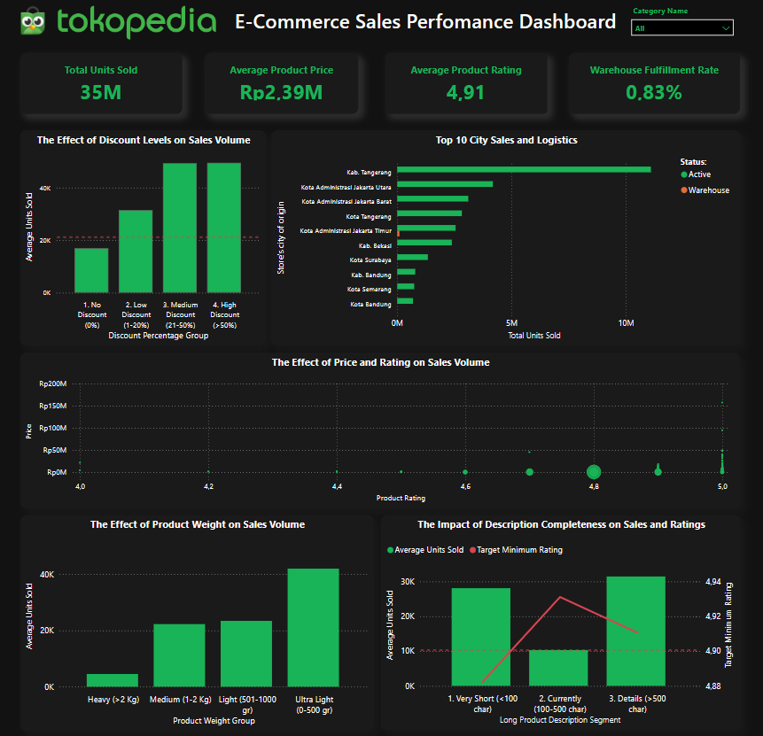

## 1. Background & Business Problems
Perusahaan e-commerce sering kali menghadapi tantangan di mana program promosi banting harga tidak memberikan dampak yang diharapkan pada performa penjualan. Berdasarkan observasi awal pada dataset, ditemukan indikasi inefisiensi promosi, di mana banyak produk dengan persentase diskon tinggi (`discount_percent`) memiliki angka volume transaksi (`sold_count`) yang rendah dan stagnan.

Untuk mendiagnosis akar masalah bisnis ini, dilakukan pendekatan analisis terstruktur menggunakan **Framework 5 Whys**:

1. **Why 1:** Mengapa produk dengan persentase diskon tinggi penjualannya tetap rendah?
   * *Jawaban:* Karena jumlah klik halaman atau tingkat kunjungan konsumen (`view_count`) pada produk tersebut sangat rendah.
2. **Why 2:** Mengapa jumlah klik pengunjung (`view_count`) produk diskon tersebut rendah?
   * *Jawaban:* Karena posisi produk kalah saing di halaman pencarian utama, tergeser oleh kompetitor dengan reputasi merchant dan penilaian bintang (`rating`) yang jauh lebih tinggi.
3. **Why 3:** Mengapa penilaian bintang (`rating`) produk tersebut tidak maksimal?
   * *Jawaban:* Karena jumlah ulasan/testimoni negatif (`review_count`) dari pembeli terdahulu cukup banyak terkait kualitas fisik barang yang meleset dari deskripsi asli toko.
4. **Why 4:** Mengapa kualitas produk dinilai buruk dan meleset dari ekspektasi deskripsi?
   * *Jawaban:* Karena pihak penjual memotong biaya produksi secara ekstrem agar bisa membanting harga murni demi mengejar persentase diskon (`discount_percent`) yang mencolok di aplikasi.
5. **Why 5 (Akar Masalah Utama):**
   * *Kesimpulan:* Strategi promosi salah fokus. Manajemen terlalu mengandalkan trik psikologi diskon coret (`discount_percent`) dan mengorbankan kualitas produk, padahal perilaku pembeli modern saat ini jauh lebih mengutamakan aspek **Reputasi Merchant** dan **Kepuasan Ulasan (`rating`)**.

## 2. Business Questions 
Berdasarkan akar masalah di atas, analisis data ini akan difokuskan untuk menjawab 5 pertanyaan bisnis strategis berikut:

1. **BQ 1 (Efektivitas Promosi):** Apakah pemberian persentase diskon (`discount_percent`) yang tinggi berbanding lurus dengan peningkatan jumlah produk yang terjual (`sold_count`)?
   * *Metrik:* `discount_percent`, `sold_count`, `price`
2. **BQ 2 (Kepercayaan Konsumen):** Manakah faktor yang lebih sensitif mendorong volume penjualan (`sold_count`) produk: harga yang murah (`price`) atau penilaian kepuasan konsumen (`rating`)?
   * *Metrik:* `price`, `rating`, `sold_count`
3. **BQ 3 (Operasional Geografis):** Bagaimana sebaran performa penjualan (`sold_count`) berdasarkan lokasi asal toko (`shop_city`) dan jalur logistiknya (`status` Active vs Warehouse)?
   * *Metrik:* `shop_city`, `status`, `sold_count`, `rating`
4. **BQ 4 (Logistik & Berat Barang):** Bagaimana korelasi antara berat produk (`weight`) dengan volume penjualan (`sold_count`) di pasar e-commerce?
   * *Metrik:* `weight`, `weight_unit`, `sold_count`
5. **BQ 5 (Optimasi Konten Halaman):** Bagaimana pengaruh panjang teks deskripsi produk (`description`) terhadap tingkat kepuasan konsumen (`rating`) dan volume penjualan (`sold_count`) di Tokopedia?

## 3. Stakeholder Identification 
Hasil dari analisis data dan rancangan dasbor ini ditujukan kepada pihak-pihak internal berikut untuk pengambilan keputusan berbasis data (*data-driven actions*):

* **VP of Marketing / CMO:** Menggunakan analisis BQ 1 & BQ 2 untuk mengoptimalkan anggaran biaya subsidi promosi agar tidak dialokasikan pada merchant dengan rating buruk.
* **Head of Logistics & Fulfillment:** Menggunakan analisis BQ 3 & BQ 4 untuk memantau efektivitas gudang otomatis (`Warehouse`) dan efisiensi ongkos kirim berdasarkan zonasi kota.
* **Category / Product Manager:** Menggunakan analisis BQ 5 untuk menentukan standardisasi pengisian halaman etalase produk (seperti minimal panjang karakter deskripsi).
* **Merchant Relations Manager:** Menggunakan ID unik merchant hasil ekstraksi untuk menyaring, mengelompokkan, dan memberikan pelatihan berkala bagi penjual dengan performa rendah.

## 4. Scope of Work (SOW) & Data Selection
Untuk menjaga efisiensi proses komputasi, ketepatan waktu proyek, serta menghindari perluasan masalah yang tidak terkontrol (*Scope Creep*), proyek portofolio ini menerapkan batasan masalah yang ketat.

Dari total **36 kolom data mentah (*raw columns*)** hasil scraping Tokopedia, dilakukan penyaringan secara selektif sehingga hanya menyisakan **9 kolom utama** yang masuk dalam cakupan analisis (*In-Scope*). Kolom sisa lainnya (seperti properti aset media gambar, tautan URL eksternal, dan ID internal sistem) resmi diabaikan karena tidak memiliki kontribusi langsung terhadap pemetaan metrik bisnis.

### 🟩 A. Scope of Variables Used

1. **`sold_count`** *(Numerik)*: Target variabel utama sebagai indikator volume transaksi sukses untuk mengukur tingkat larisnya suatu produk.
2. **`price`** *(Numerik)*: Variabel finansial harga bersih konsumen, digunakan untuk menguji sensitivitas elastisitas harga pasar.
3. **`discount_percent`** *(Teks/Numerik)*: Besaran angka diskon coret, digunakan untuk mengevaluasi efektivitas biaya promosi toko.
4. **`rating`** *(Numerik)*: Skor kepuasan pelanggan skala 1.0 s/d 5.0, digunakan sebagai representasi utama reputasi kualitas produk.
5. **`review_count`** *(Numerik)*: Akumulasi jumlah ulasan tertulis pembeli, mencerminkan tingkat interaksi riil produk di pasar.
6. **`shop_city`** *(Teks/Lokasi)*: Lokasi kota asal operasional merchant berada, digunakan untuk kebutuhan pemetaan spasial/geografis.
7. **`status`** *(Kategori)*: Jalur manajemen logistik produk, membandingkan efisiensi pengiriman mandiri (`Active`) vs gudang otomatis (`Warehouse` / Dilayani Tokopedia).
8. **`weight`** *(Numerik)*: Berat fisik produk dalam satuan gram, digunakan untuk mengukur dampak sensitivitas beban ongkos kirim terhadap minat beli.
9. **`description`** *(Teks)*: Konten penjelasan detail spesifikasi produk, digunakan untuk analisis kuantitatif panjang karakter halaman etalase.

### 🟥 B. Out of Scope
* **No Real-Time Monitoring:** Analisis ini bersifat statis (*snapshot data*). Dasbor tidak dihubungkan ke API live Tokopedia, sehingga fluktuasi stok atau harga hari ini tidak tercakup.
* **No Internal Accounting Financials:** Proyek tidak membedah margin keuntungan bersih (*Net Profit*), biaya modal modal (*COGS*), atau beban pajak internal perusahaan karena keterbatasan ketiadaan kolom laporan keuangan internal pada raw data.
* **No Machine Learning Advanced Modeling:** Fokus proyek dibatasi pada lingkup *Descriptive & Diagnostic Analytics* (apa yang terjadi dan mengapa terjadi). Pemodelan prediktif tingkat lanjut (seperti *Predictive Sales Forecasting* atau *Sentiment Analysis AI*) dikeluarkan dari target *deliverables* proyek saat ini.

## 5. KPI Utama Bisnis & Target Sukses 

| Pertanyaan Bisnis (BQs) | KPI Utama Bisnis | Target Target / Sukses |
| :--- | :--- | :--- |
| **BQ 1: Efektivitas Promosi** | **Promo Revenue ROI** (Mengukur pengembalian profit dari modal diskon) | Korelasi positif yang signifikan; peningkatan diskon wajib diikuti kenaikan volume transaksi **minimal 25%**. |
| **BQ 2: Kepercayaan Konsumen & Strategi Harga** |**Customer Satisfaction Score (CSAT)** (Rata-rata kepuasan terhadap volume transaksi)   **Premium Pricing Penetration Rate** (Efektivitas penjualan segmen harga menengah-atas) | Mendominasi segmen produk ber-rating > 4.5 dengan kontribusi penjualan **minimum 60%** dari total pasar.  Menjaga stabilitas volume transaksi pada segmen produk premium (harga menengah-atas) agar berkontribusi **minimal 15%** terhadap total penjualan guna menjaga profit margin perusahaan. |
| **BQ 3: Operasional Geografis** | **Fulfillment SLA Rate** (Persentase adopsi pengiriman gudang otomatis) | Produk berstatus 'Warehouse' menghasilkan volume transaksi **40% lebih cepat** dibanding toko mandiri. |
| **BQ 4: Logistik Berat Barang** | **Shipping Cost Sensitivity Index** (Sensitivitas beban logistik produk) | Mengurangi hambatan *checkout* pembeli pada produk berat (>2 kg) dengan memicu volume konversi stabil. |
| **BQ 5: Optimasi Konten Halaman** | **Product Page Conversion Rate** (Efektivitas kualitas pengisian konten etalase) | Halaman produk dengan panjang deskripsi > 500 karakter memicu rata-rata volume penjualan 15% lebih tinggi dan mempertahankan nilai kepuasan pelanggan di atas 4.90.* |

## Main Insights

`1. BQ 1:` Strategi potongan harga terbukti sangat efektif mendorong performa komersial e-commerce, di mana seluruh kelompok produk berdiskon berhasil melampaui batas minimum Target KPI Sukses (21.140,8 unit) dengan lonjakan pertumbuhan volume transaksi (*sold_count*) mencapai lebih dari 150% dibandingkan produk harga normal. Namun, hubungan berbanding lurus ini mengalami hukum titik jenuh (*diminishing returns*) di mana volume penjualan mendadak stagnan dan tertahan di kisaran 49.000 unit ketika besaran promosi dinaikkan dari skala moderat (*Medium Discount 21-50%*) menjadi diskon ekstrem (*High Discount >50%*). Temuan diagnostik ini memvalidasi hipotesis awal *5 Whys* bahwa diskon ekstrem di atas 50% memicu inefisiensi anggaran berupa pembakaran uang (*revenue cannibalization*) yang menggerus margin profit tanpa menghasilkan pertumbuhan transaksi baru, karena konsumen modern cenderung memindahkan fokus keputusan belandanya pada aspek reputasi kualitas produk (*rating*) setelah angka diskon dirasa cukup kompetitif.

`2. BQ 2:` Hasil uji statistik menunjukkan angka korelasi harga terhadap penjualan sebesar -0.0629 dan korelasi rating terhadap penjualan sebesar -0.1144, yang secara matematis mengindikasikan tidak adanya hubungan linear langsung yang kuat dari masing-masing variabel secara mandiri. Namun, visualisasi Bubble Chart mengungkap fenomena perilaku konsumen yang kritis, di mana volume transaksi komersial tertinggi (diwakili oleh titik anomali/outlier kuning raksasa berskala jutaan unit terjual) terkunci secara eksklusif pada kombinasi produk berharga murah/terjangkau dengan skor penilaian kualitas optimal di angka Rating 4.8. Dari kacamata performa bisnis, temuan ini mengindikasikan ketercapaian target KPI yang bersifat parsial; Target KPI Kepuasan Konsumen (CSAT) dinyatakan SANGAT SUKSES karena volume transaksi mutlak didominasi oleh segmen produk berkualitas tinggi (kuadran kanan bawah dengan Rating 4.7 s/d 5.0). Sebaliknya, Target KPI Strategi Batas Harga dinyatakan GAGAL mencapai target akibat terjadinya perang harga (*price war stagnation*) yang memicu penurunan transaksi drastis pada produk bernilai premium, sehingga perusahaan menghadapi risiko kompresi margin profitabilitas yang ketat karena pasar hanya aktif bergerak pada komoditas berharga murah. 

`3. BQ 3:` Analisis operasional geografis mengungkap bahwa pusat kontribusi volume transaksi komersial terbesar mutlak dikuasai oleh merchant yang berbasis di Kabupaten Tangerang dengan angka penjualan menembus kisaran ~11 juta unit, disusul oleh Kota Administrasi Jakarta Utara dan Jakarta Barat sebagai klaster penopang utama pasar Tokopedia. Namun dari kacamata manajemen logistik, Target KPI *Fulfillment SLA Rate* dinyatakan GAGAL TOTAL mencapai target keunggulan operasional minimum +40%, karena sebaran volume penjualan dari awal hingga akhir 10 kota terbesar didominasi secara mutlak oleh skema pengiriman mandiri penjual (status `Active` berwarna hijau toska). Serapan program gudang otomatis *Fulfillment by Tokopedia* (status `Warehouse` berwarna oranye) terdeteksi mengalami kemacetan adopsi kritis (*severe under-utilization risk*), di mana aktivitas logistik gudang pintar hanya muncul dalam skala minor di wilayah Kota Administrasi Jakarta Timur dan bernilai nihil di wilayah potensial lainnya. 

`4. BQ 4:` Analisis logistik berat produk mengungkap adanya pola korelasi negatif yang ekstrem antara beban fisik barang dengan volume transaksi komersial, di mana rata-rata penjualan dikuasai secara mutlak oleh kelompok produk berbobot sangat ringan pada segmen 'Ultra Light (0-500 gr)' dengan rata-rata mencapai 41.970 unit akibat tingginya preferensi konsumen terhadap tarif ongkos kirim yang ekonomis. Dari perspektif performa komersial, Target KPI *Shipping Cost Sensitivity Index* dinyatakan GAGAL mencapai target kesuksesan operasional karena volume konversi produk mengalami penurunan drastis (*drop-off transaction stagnation*) hingga 89,2% dengan rata-rata penjualan hanya tersisa 4.509 unit begitu bobot barang masuk ke segmen 'Heavy (>2 Kg)'. Ketidakmampuan produk berat dalam mempertahankan stabilitas volume transaksi membuktikan adanya hambatan keputusan beli pelanggan akibat beban biaya pengiriman eksternal yang dinilai terlalu tinggi jika produk dikirim di luar klaster terdekat. 

`5. BQ 5:` Analisis optimasi konten halaman etalase mengungkap pola interaksi yang kuat antara kelengkapan informasi produk dengan performa komersial dan reputasi toko, di mana segmen produk dengan deskripsi lengkap 'Detail (>500 char)' sukses memuncaki grafik sebagai juara volume transaksi dengan rata-rata penjualan tertinggi di angka 31.418 unit sekaligus mengunci skor kepuasan pelanggan maksimal di angka Rating 4.91. Dari perspektif performa komersial, Target KPI *Product Page Conversion Rate* secara keseluruhan dinyatakan TERCAPAI SECARA PARSIAL; strategi pengisian konten etalase secara mendalam terbukti sukses mutlak mengamankan aspek kepuasan pelanggan dengan bertengger aman di atas garis batas minimum kuartil statistik (Target 4.90). Meskipun aspek volume transaksi mencatatkan pertumbuhan sebesar 11,94% (meleset tipis di bawah target matematika mutlak 15%), dominasi angka penjualan tertinggi pada segmen detail ini tetap memvalidasi pentingnya kelengkapan informasi halaman. Terdapat temuan anomali kritis pada segmen 'Sedang (100-500 char)' yang mengalami kemerosotan penjualan tajam hingga tersisa 10.279 unit namun tetap mempertahankan rating tertinggi (4.93), mengindikasikan adanya kejenuhan konsumen e-commerce yang enggan melakukan pembelian pada halaman produk yang dinilai "tanggung" secara informasi etalase. 

## Recommendation

- Merekomendasikan kepada CMO untuk menerapkan kebijakan batas atas (*price ceiling promo*) maksimal di angka 50% dan mengalihkan sisa budget subsidi promosi untuk mendanai program jaminan kualitas serta optimasi konten halaman produk.
- Merekomendasikan kepada Category Manager untuk menyusun kebijakan harga dinamis (*dynamic pricing strategy*) yang mematok produk massal pada batas harga murah yang kompetitif, sembari memperketat kendali mutu operasional merchant agar skor kepuasan ulasan tidak jatuh di bawah batas psikologis pasar di angka 4.7.
- Memberikan rekomendasi mendesak kepada Head of Logistics untuk merombak strategi penetrasi pasar dengan memberikan insentif potongan komisi toko (*merchant fee cut*) khusus bagi para top merchant di wilayah Kab. Tangerang dan Jakarta Utara agar mereka bersedia memindahkan stok fisiknya ke sistem gudang pintar Tokopedia demi mengamankan efisiensi distribusi jangka panjang.
- Memberikan rekomendasi kepada Head of Logistics untuk merancang program subsidi ongkir terzonasi (*zonal shipping subsidy*) serta memperbanyak pembukaan cabang gudang pintar lokal (*micro-fulfillment hubs*) di wilayah padat pembeli khusus untuk menampung stok barang berbobot berat agar jarak kirim memendek dan konversi penjualan kembali stabil.
- Memberikan rekomendasi strategis kepada Category Manager untuk menerbitkan regulasi operasional baru berupa kewajiban pengisian deskripsi produk minimal 500 karakter (*strict character threshold enforcement*) bagi para seller e-commerce guna mengamankan standarisasi kualitas etalase dan mendongkrak angka konversi transaksi secara massal.

## Dashboard Overview 

